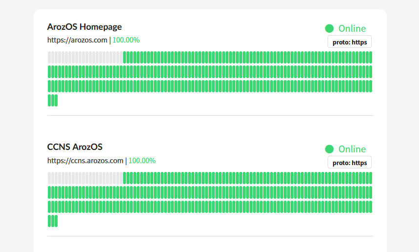

# 

# imusutm

Service up-time monitor for PHP server but written in Golang

## Usage

This project contain two parts: The PHP section and the Go section. The PHP section contains the UI and the required script to show the UI, and the Go section in charge of pinging the listed URLs at a regular interval to keep track of their online states. 

### Setup Backend Monitoring Server

Create a file named "config.json" and place it in the same folder to the binary executable.

```json
{
 "Targets": [
    {
        "ID": "imus_homepage", //ID of the target
        "Name": "imuslab Homepage", //Name to show on the UI
        "URL": "https://imuslab.com", //URL to request
        "Protocol": "https" //Protocol to check online
    },
    //More endpoint here
 ],
 "Interval": 300, //Update interval in seconds
 "LogToFile": false, //Log results to file
 "RecordsInJson": 288 //How many records to keep, in this example, 300s (5 min) x 288 records per target = 1 day
}
```

To start the monitoring server, use the following command (Note the ":")

```
./utm -p :8089
```

You can also change the port if this port has already been occupied by another service. 

*Tips: You can add it to systemd as a service if you want it to startup with your other services on Linux*

### Setup Front-end Deliverying PHP Script

The front-end is delivered by a PHP script. To use the uptime monitor, copy all files from the "php" folder and place it somewhere in the webroot.

Change the following line if you have changed the port number of the backend monitoring server startup paramter.

```php
let records = JSON.parse(`<?php echo file_get_contents("http://localhost:8089/")?>`);
```

### Auto Page Refresh

If you are planning to build a "status monitor monitor" that require the page to update the status automatically, you can uncomment and edit the following section of code from the JavaScript section of the index.php.

```javascript
setInterval(function(){
	$.get("api.php?token={{your_token}}", function(data){
		console.log("Status Updated");
		records = data;
		renderRecords();
	});
}, (300 * 1000));
```

Replace ```{{your_token}``` with a randomly generated token (e.g. UUIDv4) and put it in the api.php file token paramter.

```php
$tokens = ["{{your_token}}"];
```

That way, your page will automatically updates itself when a preset time is reached. (In the example above, it is 300 seconds = 5 minutes)


## Build from source

If you decide to build from source for the Golang part of the system, here is the command for doing that.

```bash
cd imusutm/
go mod tidy
go build
./utm 
#(or .\utm.exe if you are on Windows machine)
```

## More Protocols Support

As I only need to ping my own web servers, I currently only implemented the following protocol. If you need more protocols, feel free to create a PR on this project.

- http

- https

*Notes: You do not need to know php if you want to add more protocols. All changes are only nessary to be done in the Golang side*

### License

MIT License
